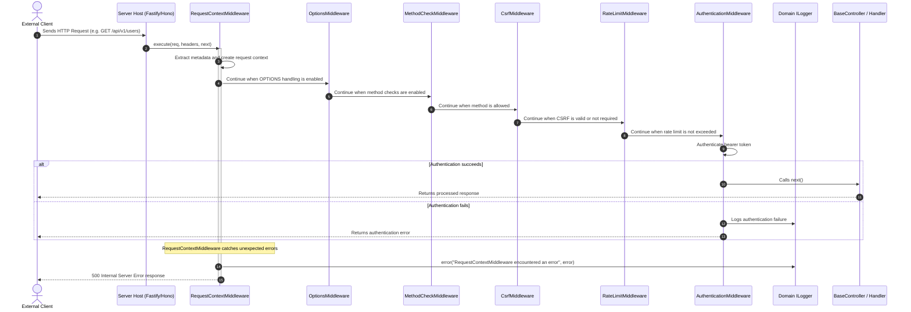

## Request Lifecycle Management through Middleware

Within a decoupled software architecture, cross-cutting concerns such as
security, traceability, and request validation require an interception system.
Xeno provides a configurable middleware stack that runs before the application
controller and handler boundary.

## Understanding the Framework's Middleware Architecture

A middleware in Xeno is an interception component positioned within the request
execution pipeline. It can create request context, validate request properties,
apply security checks, enforce traffic limits, or return a response before the
request reaches the application controller.

The system uses an ordered **middleware execution stack**. `MiddlewareModule`
registers the enabled middleware services and `CompositeMiddleware` composes
them into a chain. Each middleware either calls `next()` or returns a response
immediately.

The first middleware, `RequestContextMiddleware`, extracts request metadata and
creates the asynchronous request context through `IRequestContext.runAsync()`.
Later middleware can read correlation, request, span, network, and identity
data from that context. `AuthenticationMiddleware` updates the identity after
successful authentication.

## Which Middleware Does Xeno Provide?

`MiddlewareModule` always registers `RequestContextMiddleware` and
`AuthenticationMiddleware`. The other middleware are registered when their
corresponding `MiddlewareConfig` option is enabled or configured.

### [RequestContextMiddleware](../middlewares/request.middleware.md)

`RequestContextMiddleware` extracts metadata from HTTP headers, assigns fallback
identifiers when required, maps the request into the Xeno request context, and
executes the remaining chain inside `runAsync()`. It logs unsuccessful response
data and converts unexpected exceptions into a `500 Internal Server Error`
response.

### [AuthenticationMiddleware](../middlewares/auth.middleware.md)

`AuthenticationMiddleware` extracts an optional bearer token and passes it to
the configured `IGateKeeper`. On success, it updates the request identity and
calls `next()`. On failure, it logs the event and returns the gatekeeper error,
using `401 Unauthorized` when the error does not provide another status.

When authentication is not configured, `MiddlewareModule` registers
`NoAuthGateKeeper`. The authentication middleware remains in the chain, but the
no-auth gatekeeper supplies the unauthenticated behavior.

### [MethodCheckMiddleware](../middlewares/allow-method.middleware.md)

`MethodCheckMiddleware` is registered when `routeRegistry` is defined. It checks
the request path and HTTP method against the configured `Dictionary<HttpMethod[]>`.
If the method is not allowed, it returns a `405 Method Not Allowed` response;
otherwise, it calls `next()`.

### [CsrfMiddleware](../middlewares/csrf.middleware.md)

`CsrfMiddleware` is registered when `csrf` is configured. It validates the CSRF
value stored in the request context for `POST`, `PUT`, `DELETE`, and `PATCH`.
A missing or case-insensitively mismatched value returns a `403 Forbidden`
response. Other methods continue without this check.

### [RateLimitMiddleware](../middlewares/rate-limiter.middleware.md)

`RateLimitMiddleware` is registered when either rate-limit option is defined. It
uses the configured cache and the client IP from the request context to count
requests. The defaults are `30` requests and a `30`-second window when the
corresponding values are omitted. Requests over the limit return `429 Too Many
Requests` with a `Retry-After` header.

### [OptionsMiddleware](../middlewares/options.middleware.md)

`OptionsMiddleware` is registered when `optionsMiddleware` is `true`. It
short-circuits `OPTIONS` requests with a `204 No Content` response. Other
methods continue through the chain.

### CompositeMiddleware

`CompositeMiddleware` is the chain coordinator. It receives the enabled
middleware instances, wraps them in reverse order, and invokes the first
middleware in the resulting chain. This preserves registration order and lets
each middleware perform work before and after `next()`.

### Injected Dependencies Within the Middleware Stack

To enforce structural decoupling, the middleware services consume domain-level
and core infrastructural abstractions through constructor injection:

- **IRequestContext**: The AsyncLocalStorage engine wrapped to orchestrate
  asynchronous execution context streams.
- **IServiceExtractor**: Extracts request metadata and bearer tokens from HTTP
  headers.
- **IGateKeeper**: Authenticates the extracted token and returns an identity or
  an application error.
- **ICache**: Stores rate-limit counters when rate limiting is enabled.
- **ILogger**: Records authentication failures, rate-limit events, and request
  processing errors.

### Flow Diagram: Request Interception and Routing

The following sequence diagram shows how an HTTP request passes through the
middleware stack, including optional middleware and error handling:



## Registering Middleware through AppBuilder

Middleware registration takes place programmatically by invoking the fluent
`addMiddlewares` method on `AppBuilder`. This queues `MiddlewareModule` at
priority `3`. The module then registers the request context, authentication, and
configured optional middleware services in the `ServiceContainer`.

### Programmatic Registration Flow

To register middleware and configure the application's global behavior, the
`.addMiddlewares()` method is used in combination with the `SetupAction`
pattern:

```typescript
// src/main.ts
import { AppBuilder } from '@xeno-js/core'
import type { AppRegistry } from './infrastructure/xeno-registry/app-registry'

async function bootstrap() {
  const builder = new AppBuilder<AppRegistry>()
  builder
    .addContext()
    .addMiddlewares()
    .addServices((container) => {
      // Custom client module registrations
    })

  const container = await builder.build()
  return container
}
```

## Configuring Middleware Behavior

The `MiddlewareConfig` passed to `addMiddlewares` controls optional middleware
features. The current configuration does not define a `publicRoutes` property.
Authentication bypass behavior must therefore be implemented by the configured
`IGateKeeper` or another application-level strategy, not by a public-route
dictionary in `MiddlewareConfig`.

```typescript
// src/infrastructure/bootstrap.ts
import { AppBuilder } from '@xeno-js/core'
import type { AppRegistry } from './infrastructure/app-registry'

export async function initializeApplication() {
  const builder = new AppBuilder<AppRegistry>()

  builder.addContext().addMiddlewares((config, env) => {
    config.isSSR = false
    config.optionsMiddleware = true
    config.routeRegistry = {
      '/api/v1/users': ['GET', 'POST'],
      '/api/v1/system/health': ['GET'],
    }
    config.csrf = env.get('CSRF_TOKEN')
    config.rateLimite.maxRequests = 30
    config.rateLimite.windowSeconds = 30
    config.trustedIpHeader = 'x-forwarded-for'
  })

  const container = await builder.build()
  return container
}
```

## Error Handling in RequestContextMiddleware

When an exception escapes the downstream chain, `RequestContextMiddleware`
logs the error and returns a generic system-error response with status `500`.
The response includes the request path and generated correlation, request, and
span identifiers. The current implementation does not branch on `NODE_ENV` or
expose a separate development stack-trace response.

---

## Support Us

Xeno is an MIT-licensed open source project. It can grow thanks to the support
of these awesome people. If you'd like to join them, please read more at
[support section](../support-us)
