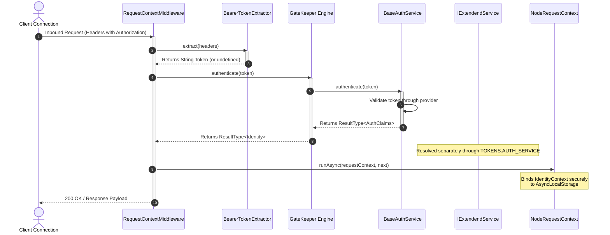

## Authentication and Identity Verification Architecture

Securing access endpoints and tracking cross-layer credentials across an
asynchronous execution stack requires a reliable approach to identity
verification. Xeno separates transport delivery layers from core security
mechanisms through a pipeline that extracts, validates, and propagates client
identity contexts securely.

---

## Understanding the Authentication Mechanism and Security GateKeeper

The authentication subsystem in Xeno separates token verification from the
application-facing authentication API. `AuthenticationMiddleware` extracts the
token, `GateKeeper` uses the base `IBaseAuthService` contract to obtain claims,
and `ClaimsIdentityMapper` converts those claims into the internal `Identity`
stored in the request context.

The extended authentication service is a separate application dependency. It
implements `IExtendendService`, which extends `IBaseAuthService` with session,
provider sign-in, sign-out, and authorization-code exchange operations. It is
resolved through `TOKENS.AUTH_SERVICE` and can be injected into application
classes that need those capabilities.

The core execution path is driven by the
[`RequestContextMiddleware`](../fundamentals/node-request-context) framework's
presentation layer. When an inbound request hits the transport layer, this
middleware intercepts the network envelope to extract metadata from the headers.



### Components of the Security Architecture

- **BearerTokenExtractor** — A discrete service that plucks the `Authorization`
  header from incoming headers, normalizes its case, and strips away the
  `Bearer` string prefix to isolate the raw cryptographic token.

- **GateKeeper** — The authentication orchestrator used by the request
  middleware. It receives `IBaseAuthService` and `IBaseMapper<AuthClaims,
  Identity>`, authenticates tokens or retrieves the current user, and returns an
  `Identity`.

- **IBaseAuthService** — The minimum authentication contract used by
  `GateKeeper`. It exposes `isAuthenticated()`, `getUser()`, and
  `authenticate(token)`.

- **IExtendendService** — The extended application contract. It includes the
  base authentication operations plus `signInWithProvider()`, `getSession()`,
  `signOut()`, and `exchangeCodeForSession()`.

- **AuthClaims Schema** — A strongly-typed contract that structures identity
  components, containing user identifiers (`sub`), allocated application
  `roles`, active fine-grained `permissions`, and tenant identifiers
  (`tenantId`).

- **ClaimsIdentityMapper** — Maps external authentication vendor claims into a
  standardized internal `Identity` object, separating the core application from
  specific third-party data structures.

---

## Handling Missing or Invalid Bearer Tokens and Error Serialization

When an `IGateKeeper` returns a failed authentication Result, Xeno halts
execution early. `AuthenticationMiddleware` short-circuits the pipeline and
returns a standardized, machine-readable error response. The default status is
`401 Unauthorized` when the returned application error does not provide another
status.

The current middleware configuration does not define `publicRoutes`. The
configured `IGateKeeper` receives the extracted optional token. With the
Supabase-backed `GateKeeper`, a valid token is authenticated through the base
auth service; when no usable token is available, it attempts to retrieve the
current user and otherwise returns the guest identity. Therefore, the built-in
`GateKeeper` can allow an unauthenticated request to continue with the guest
identity; authorization policies determine whether a later Command or Query
may execute.

The `AuthenticationMiddleware` updates the request context after successful
authentication. If the gatekeeper returns a failed Result, the middleware logs
the failure and short-circuits the chain before the application Handler.

### Technical Properties of an Unauthenticated Rejection

- **Status Code** — `401 Unauthorized` (`STATUS_CODES.UNAUTHORIZED`), indicating
  that the client must present valid credentials before retrying the
  transaction.

- **Error Code** — The error code returned by the `IGateKeeper` Result. The
  middleware does not replace it with a fixed authentication code.

- **Response Envelope** — A structured `ResponseDto` object populated with an
  `ErrorResponseDto` payload. It explicitly marks `success: false` and bundles
  the endpoint path, unique `correlationId` tracking flags, a `requestId`
  parameter, and an ISO 8601 server `timestamp`.

- **Audit Logging Behavior**: Authentication failures are logged through
  `ILogger.warn()` with the request path and returned error code.

For the request-level execution details, see
[AuthenticationMiddleware](../middlewares/auth.middleware.md).

---

## Configuring Supabase Authentication via the AppBuilder Utility

Integrating Supabase authentication within Xeno requires programmatically
binding endpoint credentials using the fluent AppBuilder interface. The built-in
authentication client factory initializes the native client stream, registers
custom identity mappers, and injects the verified provider directly into the
framework security gatekeeper loop.

Xeno includes a built-in Supabase integration. When enabled, the framework
creates a `SupabaseAuthService` through `SupabaseServerAuthFactory`. The service
implements both `IBaseAuthService` and `IAuthService`, so the same provider can
support GateKeeper authentication and application-level session operations.

Successful authentication responses are mapped by `SupabaseClaimsMapper` into
the shared `AuthClaims` contract and then into the internal `Identity` by
`ClaimsIdentityMapper`. The provider also uses `SupabaseSessionMapper` for
session results.

### Integrating Supabase via Bootstrapping

To wire up the Supabase integration provider, apply the `.addAuth()` setup
action block during the application bootstrapping cycle:

```typescript
// src/infrastructure/bootstrap-security.ts
import { AppBuilder } from '@xeno-js/core'
import type { AppRegistry } from './infrastructure/app-registry'

export const bootstrap = async () => {
  const builder = new AppBuilder<AppRegistry>()

  builder
    // 1. Activate AsyncLocalStorage context isolation boundaries
    .addContext()

    // 2. Mount and configure the Supabase provider via SetupAction
    .addAuth((options, env) => {
      options.url = env.getOrThrow('SUPABASE_URL')
      options.key = env.getOrThrow('SUPABASE_KEY')

      options.opts = {
        auth: {
          persistSession: false,
          autoRefreshToken: false,
        },
      }

      options.ssrOpts = (container) => ({
        getAll: () => [],
        setAll: () => undefined,
      })
    })

  return await builder.build()
}
```

## Base and Extended Authentication Services

Xeno exposes two authentication contracts with different responsibilities.

### `IBaseAuthService`: The GateKeeper Contract

`IBaseAuthService` is the minimum contract required by `GateKeeper`. It defines:

- `isAuthenticated(): Promise<boolean>`;
- `getUser(): Promise<ResultType<Maybe<AuthClaims>>>`;
- `authenticate(token: string): Promise<ResultType<AuthClaims>>`.

`AuthUtils.addAuthN()` registers an implementation of this contract with
`TOKENS.BASE_AUTH_SERVICE`. It then constructs `GateKeeper` with that token and
the claims mapper. Application code normally does not need to resolve this
token directly.

### `IExtendendService`: The Application Contract

`IExtendendService` extends `IBaseAuthService` with the application-facing
authentication operations:

- `signInWithProvider(provider)`;
- `getSession()`;
- `signOut()`;
- `exchangeCodeForSession(code)`.

When `addAuth()` is configured, the same provider is registered as a scoped
service under `TOKENS.AUTH_SERVICE`. A custom provider must implement the
complete `IExtendendService` contract before it can be used as the extended
authentication service. The class that consumes it should resolve
`TOKENS.AUTH_SERVICE` through Dependency Injection and receive the resolved
service in its constructor.

```typescript
import { TOKENS } from '@xeno-js/core'
import type { IExtendendService } from '@xeno-js/core'
import type { IServiceContainer } from '@/domain'

export class AccountService {
  constructor(private readonly _authService: IExtendendService) {}

  public async getCurrentSession() {
    return this._authService.getSession()
  }
}

export function registerAccountService(container: IServiceContainer) {
  container.addScoped('ACCOUNT_SERVICE', (scope) => {
    return new AccountService(scope.resolve(TOKENS.AUTH_SERVICE))
  })
}
```

The built-in `SupabaseAuthService` already implements `IExtendendService`. For a
custom provider, implement all methods from `IBaseAuthService` and `IAuthService`
and register the implementation under `TOKENS.AUTH_SERVICE` with the
application container. The `GateKeeper` dependency must remain compatible with
`IBaseAuthService`; it is registered separately under
`TOKENS.BASE_AUTH_SERVICE`.

The distinction is intentional: `GateKeeper` resolves the base contract from
`TOKENS.BASE_AUTH_SERVICE` for request authentication, while application
services resolve the extended contract from `TOKENS.AUTH_SERVICE` when they need
session management or provider-based authentication flows.

> [!WARNING]
>
> To use the built-in Supabase integration, install the required dependencies:
>
> ```bash
> npm i @supabase/supabase-js
>
> ```

The server-side factory also requires an `ssrOpts` callback that adapts the
application's cookie storage to the `ISsrCookieHandler` contract. The callback
must provide real `getAll()` and `setAll()` behavior for SSR session handling;
the empty implementation in the example is only a structural placeholder.

---

## Support Us

Xeno is an MIT-licensed open source project. It can grow thanks to the support
of these awesome people. If you'd like to join them, please read more at
[support section](../support-us)
