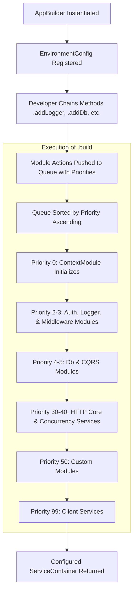

## Fluent Application Bootstrapping with AppBuilder

Bootstrapping a decoupled, layered application requires coordinating diverse
infrastructure modules—such as logging channels, database connection pools,
authentication clients, and CQRS pipeline behaviors—without tightly coupling
them together. Xeno.JS resolves this coordination challenge through the
**AppBuilder** primitive, which serves as a centralized, fluent bootstrapper.

---

## What is the AppBuilder and How Does It Structure Bootstrapping?

The `AppBuilder` is a fluent, programmatic bootstrapper for Xeno.JS applications.
It collects module registration actions, applies configuration callbacks, and
initializes the registered modules in priority order inside a
`ServiceContainer`.

The `AppBuilder` provides a .NET-style configuration experience without
directory scanning or declarative decorators. Its constructor registers and
resolves the `EnvironmentConfigurationService`. Methods such as `addLogger`,
`addDb`, `addPipeline`, `addHttpCore`, `addModule`, and `addServices` then
configure the builder or add asynchronous actions to its internal module queue.
Calling `build()` executes those actions and returns the configured
`ServiceContainer`.

### Key Architectural Characteristics

- **Fluent API Interface** — Exposes chainable, high-level orchestration methods
  that guide the developer through an orderly configuration workflow.
- **Deferred Module Initialization** — Postpones module imports, instantiation,
  and registration actions until `build()` is called. A `SetupAction` callback,
  when supplied, runs immediately while the builder method is called.
- **Automated Context Safeguards** — Automatically schedules core contextual
  prerequisites (such as the `ContextModule`) when dependent systems (like CQRS
  pipelines or request middlewares) are registered.
- **Configuration Provisioning** — Passes the shared
  `IConfigurationService` to setup callbacks so configuration can read
  environment values without directly accessing infrastructure modules.

---

## Understanding the Internal Module Queueing and Execution Priority

The module execution engine of AppBuilder operates on a deterministic,
priority-based sorting mechanism. Each registered subsystem is assigned an
explicit integer priority, ensuring that system-critical configurations like
database clients and authentication services initialize before domain logic or
custom HTTP endpoints.

At its core, `AppBuilder` manages an internal array of queued modules
(`QueuedModule[]`). Methods that register modules push an executable action and
a numeric priority into this array. Configuration callbacks for methods such as
`.addLogger()` and `.addDb()` run immediately; the module action itself is
deferred until `build()`.

### Bootstrapping Lifecycle and Priorities

When `.build()` is invoked, the builder sorts the queue in ascending order by
priority and awaits each module action sequentially. If an action fails,
`AppBuilder` logs the module name and throws an error identifying the bootstrap
failure.



The table below outlines the default system priorities utilized during the
execution of `.build()`:

- **ContextModule (Priority 0)** — Initializes request-scoped state boundaries
  via `AsyncLocalStorage` before any subsequent module accesses the resolution
  stack.
- **AuthModule (Priority 2)** — Configures the authentication integration.
- **LoggerModule / MiddlewareModule / CacheModule (Priority 3)** — Registers
  the configured logging, middleware, and cache services.
- **DbModule (Priority 4)** — Configures the database module with its connection
  string and SQL-based configuration.
- **CqrsModule (Priority 5)** — Configures the CQRS module with the pipeline,
  command bus, and query bus settings.
- **HttpCoreModule (Priority 30)** — Binds network transport settings, outbound
  client configurations, data source registration, and resilience settings.
- **ConcurrencyServiceModule (Priority 40)** — Registers the concurrency
  service used to limit concurrent asynchronous work.
- **Custom Modules (Priority 50)** — Mounts user-defined external packages
  utilizing the standard `IModule` contract.
- **Client Services (Priority 99)** — Evaluates custom service factories
  declared directly within the application.

---

## Decoupling Configurations with the SetupAction Functional Paradigm

`SetupAction` is a typed callback contract used to configure Xeno.JS modules. It
receives a mutable configuration value and the shared `IConfigurationService`,
enabling application settings to be read from the environment without exposing
module instances to the caller.

Rather than requiring pre-constructed configuration objects, `AppBuilder`
methods accept callbacks that follow the `SetupAction` signature:

```typescript
export type SetupAction<TConfig, TContext = IConfigurationService> = (
  config: TConfig,
  context: TContext,
) => void
```

The builder passes the mutable configuration structure (`TConfig`) and the
active `IConfigurationService` to the callback. The callback executes during
the builder method call, before the corresponding module action is queued. This
allows environment values to be mapped to module settings before bootstrapping.

### Programmatic SetupAction Implementation

The following example demonstrates how the `SetupAction` pattern cleanly
delegates database configuration options without exposing raw infrastructure
components to the outer scope:

```typescript
import { AppBuilder, LOG_LEVEL } from '@xeno-js/core'
import type { AppRegistry } from './registry'

async function bootstrap() {
  const builder = new AppBuilder<AppRegistry>()

  // Configure the DB module through SetupAction
  builder.addDb((config, env) => {
    const dbUrl = env.getOrThrow('DATABASE_URL')
    config.connectionString = dbUrl
  })

  // Configure logging parameters through SetupAction
  builder.addLogger((config, env) => {
    config.level =
      env.get('LOG_LEVEL') === 'production' ? LOG_LEVEL.INFO : LOG_LEVEL.DEBUG
    config.console = true
  })

  const container = await builder.build()
  return container
}
```

## Constraints and Current Behavior

- `build()` sorts all queued actions by ascending priority and awaits them one
  at a time.
- Calling a module-registration method more than once does not always have the
  same effect. Logger, cache, authentication, database, concurrency, pipeline,
  and middleware modules guard against duplicate registration; custom modules,
  services, HTTP core actions, and allowed origins are added to the queue for
  each call.
- Registering a CQRS pipeline or middleware also queues the context module when
  it has not already been queued.
- `addServices()` runs its service-registration callback during the build phase
  at priority `99`.
- `resolve()` resolves a registered service from the builder's
  `ServiceContainer`; it does not add a new service.

---

## Support Us

Xeno.JS is an MIT-licensed open source project. It can grow thanks to the support
of these awesome people. If you'd like to join them, please read more at
[support section](../../support-us)
