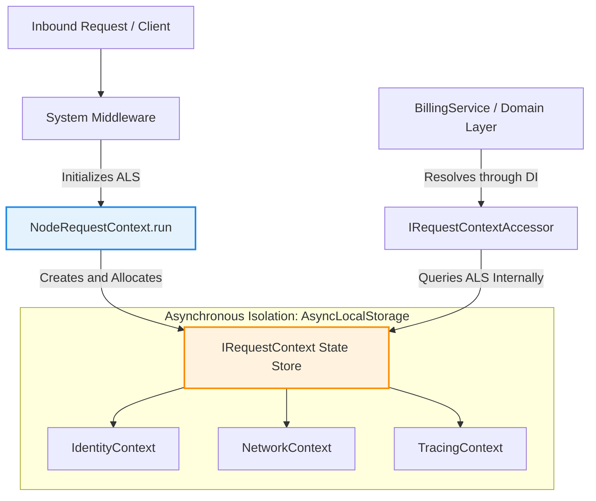

## Asynchronous Context Isolation with NodeRequestContext

Within modern, highly concurrent server applications, maintaining
request-specific state (such as user identity, tenant identifier, or tracing
data) throughout the entire asynchronous call chain represents a complex
architectural challenge. Xeno.JS solves this problem natively through the
**NodeRequestContext** class, leveraging the asynchronous mechanisms of the
Node.js runtime.

---

## Understanding How NodeRequestContext Works

`NodeRequestContext` is the Xeno.JS execution-context implementation built on
Node.js `AsyncLocalStorage`. It isolates request-specific data across an
asynchronous execution chain and exposes typed accessors for the active context,
identity, network data, and service scope.

Unlike traditional "parameter drilling", where every interface or service must
accept a `context` object among its arguments, `NodeRequestContext` stores the
current state directly inside Node.js thread's asynchronous execution store.
This allows registered services and application components to access the active
context through interfaces instead of receiving context values through every
method signature. Access is available only while code executes inside the
corresponding asynchronous context boundary.

### Data Propagation Flow in the Asynchronous Context

The flow diagram below illustrates how context state is inserted into the
asynchronous boundary and safely retrieved by lower architectural layers.



---

## How to Automatically Register the Context with AppBuilder

Context registration takes place through the fluent `addContext` method on
`AppBuilder`. This queues `ContextModule` at priority `0`. During `build()`, the
module registers the `NodeRequestContext`, service-scope factory, context
accessors, and user-context factory in the `ServiceContainer`.

Context activation is a centralized operation that declares the presence of
isolation services within the application's bootstrap lifecycle. The following
example shows how to activate the module inside the framework bootstrap file:

```typescript
// src/main.ts
import { AppBuilder } from '@xeno-js/core'
import type { AppRegistry } from './infrastructure/xeno-registry/app-registry'

async function bootstrap() {
  const builder = new AppBuilder<AppRegistry>()

  builder
    // 1. Automatically registers the ContextModule in the ServiceContainer
    .addContext()

    // 2. Configures the remaining dependent modules
    .addMiddlewares()
    .addLogger()

  const container = await builder.build()
  return container
}
```

If the developer registers middleware or a CQRS pipeline without explicitly
invoking `.addContext()`, `AppBuilder` queues the context module automatically
as a prerequisite. Other modules do not necessarily queue it automatically.

---

## Detailed Structure of the Xeno.JS Execution Context

The Xeno.JS execution context is structured into specialized sub-contexts that
describe the active request or operation. The contracts include `Identity` for
authentication and authorization data, `NetworkContext` for request metadata,
`TracingContext` for observability, and optional `MessagingContext` data for
message-based workflows.

The main `RequestContext` interface unifies access to these different aspects of
execution state, organizing them according to precise logical categories for
cross-layer interaction:

```typescript
// src/domain/contracts/context/context_types/request-context.types.ts
import type { Maybe } from '@/shared'
import type { Identity } from './identity-context.types'
import type { MessagingContext } from './messaging-context.types'
import type { NetworkContext } from './network-context.types'
import type { TracingContext } from './tracing-context.types'

export interface RequestContext {
  readonly identity: Identity
  readonly network: NetworkContext
  readonly tracing: TracingContext
  readonly messaging?: Maybe<MessagingContext>
}
```

### Inner Abstraction Sub-Interfaces

To understand the fine-grained data layout, the core sub-interfaces expose the
following explicit type specifications:

```typescript
import type { Guid, Optional } from '@/shared'

export interface Identity {
  readonly userId: Optional<Guid>
  readonly email: Optional<string>
  readonly name: Optional<string>
  readonly tenantId: Optional<Guid>
  readonly roles: Optional<string[]>
  readonly permissions: Optional<string[]>
}

export interface NetworkContext {
  readonly requestId: Guid
  readonly clientIp: Optional<string>
  readonly userAgent: Optional<string>
  readonly formatIndicator: Optional<string>
  readonly path: Optional<string>
  readonly csrf: Optional<string>
  readonly transport: Optional<{ req: unknown; res: unknown }>
}

export interface TracingContext {
  readonly correlationId: Guid
  readonly startTime: number
  readonly spanId: Optional<string>
  readonly parentSpanId: Optional<string>
}

export interface MessagingContext {
  readonly returnAddress: Optional<string>
  readonly expiration: Optional<number>
  readonly sequence: Optional<MessageSequence>
}

export interface MessageSequence {
  readonly sequenceId: Optional<string>
  readonly position: Optional<number>
  readonly size: Optional<number>
}
```

---

## Semantic Structure of Context Data

- **Identity Context** — Encapsulates the token-extracted user properties,
  including the `userId` and the logical partitioning `tenantId`.

- **Network Context** — Captures request and transport metadata, such as
  `requestId`, `clientIp`, `path`, `formatIndicator`, `csrf`, and the optional
  transport request and response objects.

- **Tracing Context** — Manages system-wide telemetry metadata, exposing the
  root `correlationId` and operational `startTime` performance metrics.

- **Messaging Context** — Maps optional message metadata for event-driven
  boundaries, including return addresses, expiration values, and sequence data.

---

## Accessing Contexts and Injecting Context Accessors

Xeno.JS avoids exposing the native `AsyncLocalStorage` instance directly to
application services. Instead, `ContextModule` registers granular,
single-responsibility **Accessor Interfaces** as singletons.

### The Core Context Accessors Exposed by the Framework

The framework automatically configures and binds four context accessor
interfaces to the active `NodeRequestContext`:

- **IContextAccessor<RequestContext>** — (`TOKENS.CONTEXT_ACCESSOR`) exposes
  `getContext()`, which returns the optional active `RequestContext`.

- **IIdentityAccessor** — (`TOKENS.IDENTITY_ACCESSOR`) exposes `getIdentity()`
  and returns an optional `Identity` object.

- **INetworkContextAccessor** — (`TOKENS.NETWORK_CONTEXT_ACCESSOR`) exposes
  `getNetworkContext()` and returns an optional `NetworkContext` object.

- **IServiceScopeAccessor** — (`TOKENS.SERVICE_SCOPE_ACCESSOR`) exposes
  `getScope()`, enabling infrastructure code to resolve dependencies within the
  active service scope.

`NodeRequestContext` also implements `IRequestContext`, which adds
`runAsync(context, callback)` for creating the asynchronous boundary and
`updateIdentity(identity)` for replacing the current identity after successful
authentication. `ContextModule` registers the same request-context instance for
these accessor tokens.

### Injection and Usage in Domain Services

By registering these decoupled accessors inside the root dependency container,
any service can demand a specific, granular context interface within its
constructor. This maintains domain-layer purity and eliminates direct coupling
to runtime-specific components.

The following architectural layout demonstrates how to bootstrap application
services with the framework accessors, followed by their internal domain
consumption:

```typescript
// src/infrastructure/bootstrap.ts
import { AppBuilder, TOKENS } from '@xeno-js/core'
import { BillingService } from '@/domain/services/billing.service'
import type { AppRegistry } from './infrastructure/app-registry'

async function bootstrap() {
  const builder = new AppBuilder<AppRegistry>()

  builder
    .addContext() // Implicitly wires TOKENS.IDENTITY_ACCESSOR and TOKENS.CONTEXT_ACCESSOR
    .addServices((container) => {
      // Injecting the decoupled accessor interface token directly into the service factory
      container.addScoped('BILLING_SERVICE', (c) => {
        return new BillingService(c.resolve(TOKENS.IDENTITY_ACCESSOR))
      })
    })

  return await builder.build()
}
```

```typescript
// src/domain/services/billing.service.ts
import type { IIdentityAccessor } from '@xeno-js/core'

export class BillingService {
  // The framework's static identity accessor is cleanly injected into the constructor boundary
  constructor(private readonly _identityAccessor: IIdentityAccessor) {}

  public async processInvoice(amount: number): Promise<void> {
    const identity = this._identityAccessor.getIdentity()

    if (!identity || !identity.tenantId) {
      throw new Error(
        'Execution Failed: Tenant identifier not detected in asynchronous context.',
      )
    }

    const currentUserId = identity.userId ?? 'SYSTEM'

    console.log(
      `[Billing] Processing invoice of €${amount} for Tenant ID: ${identity.tenantId}`,
    )
    console.log(`[Audit] Operation started by user: ${currentUserId}`)

    // Strict, tenant-isolated operations proceed safely here...
  }
}
```

---

## Support Us

Xeno.JS is an MIT-licensed open source project. It can grow thanks to the support
of these awesome people. If you'd like to join them, please read more at
[support section](../../support-us)
