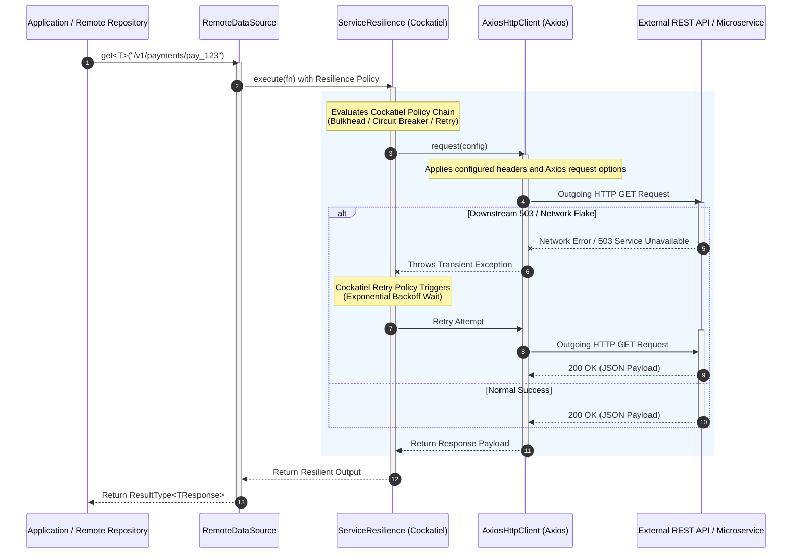

## Resilient Outgoing HTTP Communications with HTTP Core

The **HTTP Core** module in Xeno.JS configures outgoing HTTP requests to external
REST APIs and remote services. It combines an `IHttpClient` implementation based
on Axios with an `IServiceResilience` implementation based on Cockatiel.
`RemoteDataSource` uses both services and returns remote payloads inside
`ResultType<T>` values.

---

## What is HTTP Core and How It Works

HTTP Core abstracts external HTTP communication behind `IHttpClient` and
`RemoteDataSource`. The current built-in transport is `AxiosHttpClient`; the
contracts remain independent of the concrete transport implementation.

When an application service or repository executes an external HTTP call:

1. **Remote Data Source Invocation**: A repository or integration service
  extends `RemoteDataSource` and calls typed methods such as `get`, `post`,
  `put`, `patch`, or `delete`.
2. **Resilience Policy Wrapping (Cockatiel)**: `ServiceResilience` executes the
  HTTP operation through the configured bulkhead, circuit breaker, and retry
  policy chain.
3. **HTTP Transport Execution (AxiosHttpClient)**: The client applies the
  configured base URL, headers, timeout, query parameters, abort signal, and
  response validation to the Axios request.
4. **Result Mapping**: `RemoteDataSource` returns `response.data` wrapped in
  `Result.ok()`. Transport and resilience exceptions propagate to the caller.



---

## Key Actors in HTTP Core

The HTTP Core module divides external HTTP communication across four primary
components:

```text
┌───────────────────────────────────────────────────────────────────────────┐
│                            HTTP Core Subsystem                            │
│                                                                           │
│   ┌──────────────────────────┐             ┌──────────────────────────┐   │
│   │    RemoteDataSource      │ ──────────> │   ServiceResilience      │   │
│   │ (Base Remote Repository) │             │   (Cockatiel Policies)   │   │
│   └──────────────────────────┘             └──────────────────────────┘   │
│                 │                                        │                │
│                 ▼                                        ▼                │
│   ┌──────────────────────────┐             ┌──────────────────────────┐   │
│   │     AxiosHttpClient      │ ──────────> │      HttpCoreModule      │   │
│   │   (Axios HTTP Engine)    │             │   (IoC Registration)     │   │
│   └──────────────────────────┘             └──────────────────────────┘   │
└───────────────────────────────────────────────────────────────────────────┘

```

### 1. `AxiosHttpClient`

The built-in `IHttpClient` implementation that encapsulates an `axios` instance.
It applies the configured base URL, default headers, timeout, query parameters,
abort signal, redirects, decompression, and credentials settings. It converts
successful Axios responses into `HttpResponse<T>` and maps HTTP or transport
failures to `AppError`.

### 2. `ServiceResilience` (Cockatiel Integration)

The `IServiceResilience` implementation built on top of **Cockatiel**. It
executes an operation through the configured policy chain, including:

- **Bulkhead Policy**: Limits concurrent operations.
- **Circuit Breaker Policy**: Opens after the configured number of consecutive
  transient failures and later permits a half-open recovery attempt.
- **Retry Policy**: Retries transient and idempotent HTTP operations using
  exponential backoff. Transient failures include network errors, status `408`,
  status `429`, and `5xx` responses.

The current resilience configuration does not define a fallback policy. Request
timeouts are provided by the HTTP client configuration or an `AbortSignal`, not
by a separate timeout property in `ResilienceConfig`.

### 3. `RemoteDataSource`

The abstract base data source designed to be extended by infrastructure remote
repositories (e.g., `PaymentRemoteDataSource`, `NotificationClient`). It
combines `IHttpClient` and `IServiceResilience` into a unified helper interface
for executing typed HTTP operations (`get`, `post`, `put`, `patch`, `delete`).
Each method returns `Promise<ResultType<TResponse>>`.

### 4. `HttpCoreModule`

The framework container module responsible for registering the configured HTTP
client and resilience singleton inside the Dependency Injection Container. The
current `HttpCoreModule` invokes `HttpUtils.addAxios()` and
`HttpUtils.addResilience()`; application-specific `RemoteDataSource` instances
are registered separately.

---

## Registering and Configuring HTTP Core via AppBuilder

HTTP Core is registered during host bootstrapping using the `.addHttpCore()`
setup method on `AppBuilder`.

```typescript
// src/infrastructure/bootstrap-http-core.ts
import { AppBuilder } from '@xeno-js/core'
import type { AppRegistry } from './infrastructure/app-registry'

export const bootstrap = async () => {
  const builder = new AppBuilder<AppRegistry>()

  builder.addContext().addHttpCore((opts, configuration) => {
    // Configure the HTTP client token and Axios settings
    opts.http.token = 'PAYMENT_HTTP_CLIENT_TOKEN'
    opts.http.client.baseURL = configuration.get(
      'PAYMENT_GATEWAY_URL',
      'https://api.payments.com',
    )
    opts.http.client.timeoutMs = 10000
    opts.http.client.defaultHeaders = {
      Accept: 'application/json',
      'Content-Type': 'application/json',
    }
    opts.http.client.proxy = false

    // Configure retry, circuit breaker, and bulkhead policies
    opts.resilience.retry.attempts = 10
    opts.resilience.retry.baseDelayMs = 100
    opts.resilience.retry.maxDelayMs = 1000
    opts.resilience.circuitBreaker.consecutiveFailures = 7
    opts.resilience.circuitBreaker.halfOpenTimeoutMs = 5000
    opts.resilience.bulkhead.maxConcurrent = 5
  })

  return await builder.build()
}
```

---

## How to Use HTTP Core in Application Code

To interact with external services, extend `RemoteDataSource` or inject
`IHttpClient` and `IServiceResilience` into infrastructure repositories.

### Register The DataSource Token in AppRegistry

```typescript
// src/infrastructure/app-registry.ts
import { IHttpClient, IRemoteDataSource, XenoRegistry } from '@xeno-js/core'

export interface AppRegistry extends XenoRegistry {
  PAYMENT_DATA_SOURCE: IRemoteDataSource
  PAYMENT_HTTP_CLIENT_TOKEN: IHttpClient
}
```

### Extending `RemoteDataSource` (Recommended Pattern)

```typescript
// src/infrastructure/datasources/payment-remote.datasource.ts
import {
  RemoteDataSource,
  type IHttpClient,
  type IServiceResilience,
  type ResultType,
} from '@xeno-js/core'

export interface PaymentGatewayResponse {
  transactionId: string
  status: 'APPROVED' | 'DECLINED'
  amount: number
}

export class PaymentRemoteDataSource extends RemoteDataSource {
  constructor(axiosClient: IHttpClient, resilienceService: IServiceResilience) {
    super(axiosClient, resilienceService)
  }

  public async processCharge(
    payload: { amount: number; cardToken: string },
    signal?: AbortSignal,
  ): Promise<ResultType<PaymentGatewayResponse>> {
    // The base class applies the configured resilience service.
    return await this.post<PaymentGatewayResponse>('/v1/charges', payload, {
      signal,
    })
  }

  public async getTransactionStatus(
    transactionId: string,
    signal?: AbortSignal,
  ): Promise<ResultType<PaymentGatewayResponse>> {
    return await this.get<PaymentGatewayResponse>(
      `/v1/charges/${transactionId}`,
      { signal },
    )
  }
}
```

### Registering the Remote Data Source in the Container

```typescript
// src/infrastructure/bootstrap-services.ts
import { AppBuilder, TOKENS } from '@xeno-js/core'
import { PaymentRemoteDataSource } from './datasources/payment-remote.datasource'
import type { AppRegistry } from './infrastructure/app-registry'

export const bootstrap = async () => {
  const builder = new AppBuilder<AppRegistry>()

  builder
    .addHttpCore((opts, config) => {
      // HttpCoreModule registers these two dependencies during build.
      opts.http.token = 'PAYMENT_HTTP_CLIENT_TOKEN'
      opts.http.client.baseURL = config.get(
        'PAYMENT_GATEWAY_URL',
        'https://api.payments.com',
      )
      opts.http.client.timeoutMs = 5000
    })
    .addServices((container) => {
      // Register application-specific RemoteDataSource after HTTP Core.
      container.addSingleton('PAYMENT_DATA_SOURCE', (c) => {
        const httpClient = c.resolve('PAYMENT_HTTP_CLIENT_TOKEN')
        const resilienceService = c.resolve(TOKENS.RESILIENCE_CLIENT)

        return new PaymentRemoteDataSource(httpClient, resilienceService)
      })
    })
  return await builder.build()
}
```

`HttpCoreModule` registers the HTTP client and resilience service during the
priority `30` AppBuilder phase. `RemoteDataSource` instances are application
services and must be registered separately after those dependencies are
available, for example through `addServices()` at priority `99`.

The current implementation has these constraints:

- `opts.http.token` must be defined when `HttpCoreModule` is configured;
- retry applies only to transient failures on idempotent methods: `GET`, `PUT`,
  `DELETE`, `HEAD`, and `OPTIONS`;
- `POST` and `PATCH` failures are not retried by the built-in retry predicate;
- `RemoteDataSource` returns the response payload in `ResultType<T>` but does
  not convert transport or resilience exceptions into failed Results;
- `dataSourceToken` exists in `HttpCoreConfig`, but the current
  `HttpCoreModule` does not execute it automatically;
- tracing headers are not injected automatically by `AxiosHttpClient`;
- fallback and a dedicated resilience timeout policy are not available in the
  current `ResilienceConfig`.

---

## Why Should You Use HTTP Core?

1. **Built-in Resilience (Cockatiel Integration)** HTTP Core provides
  configurable bulkhead, circuit breaker, and conditional retry policies for
  operations executed through `RemoteDataSource`.
2. **Agnostic HTTP Contract** `IHttpClient` isolates application code from the
  concrete Axios transport and normalizes successful responses as
  `HttpResponse<T>`.
3. **Standardized Remote Data Source (`RemoteDataSource`)** Infrastructure
  repositories can reuse a typed API that combines HTTP transport and
  resilience, returning `ResultType<TResponse>` values.
4. **Centralized Client Configuration and Dependency Injection** Base URLs,
  headers, timeouts, transport options, and resilience thresholds are
  configured through `AppBuilder.addHttpCore()`.

---

> **Warning: HTTP Core dependencies** HTTP Core requires `axios` and `cockatiel`
> at runtime. Install them in the application workspace when enabling
> `.addHttpCore()`:
>
> ```bash
> npm install axios cockatiel
>
> ```
>
> If either dependency is missing, module resolution fails when Xeno.JS creates the
> HTTP client or resilience implementation.

---

## Support Us

Xeno.JS is an MIT-licensed open source project. It can grow thanks to the support
of these awesome people. If you'd like to join them, please read more at
[support section](../support-us)
